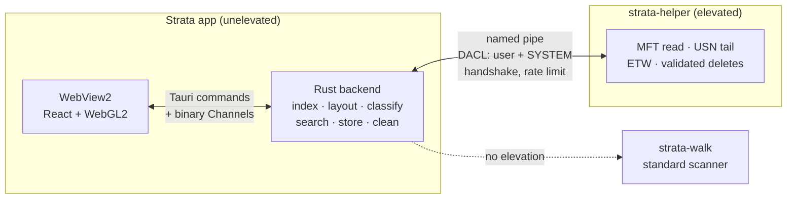

# Strata

A native Windows disk-space app that reads the NTFS Master File Table directly and tells you
what is using your disk, who put it there, when, and whether it is safe to delete.

## Download

Get the latest installer from [Releases](https://github.com/BankkRoll/STRATA/releases/latest).
See it running in your browser on the [website](https://bankkroll.github.io/STRATA/).

- Windows 10 22H2+ or Windows 11, x64 or ARM64.
- `Strata_<version>_x64-setup.exe` for x64 PCs, `Strata_<version>_arm64-setup.exe` for ARM64.
- Updates download in the background and install from inside the app.
- Signed builds are verified by Windows; if a build has no signature, SmartScreen asks you to
  confirm (More info → Run anyway).

## Features

- **MFT scanning:** reads `$MFT` raw instead of walking directories, with exact size accounting
  for hardlinks, alternate data streams, compression, sparse files and cloud placeholders.
  A parallel standard scanner covers ReFS, FAT/exFAT, network shares and unelevated sessions.
- **Live updates:** an in-memory index of under 64 bytes per entry applies changes from the USN
  change journal in place, so every view stays current without rescanning.
- **Explains your data:** rule packs classify each file by category, owning app and safety tier
  (`safe`, `probably`, `careful`, `never`), and show exactly why a path matched.
- **Safe cleanup:** a hard-coded never-delete list, re-verification right before every delete,
  Recycle Bin by default with one-click restore, and "which process has this locked?".
- **Search:** Everything-style name search with filters (`*.gguf size:>1gb`), first results in
  about a millisecond over 5 million names.
- **History:** snapshots, diffs and "what grew since last scan".
- **Duplicates:** size, partial-hash and full-hash matching that skips hardlinks and never
  downloads cloud-only files.
- **Activity (opt-in):** ETW tracing shows which process is writing what, right now.
- **Views:** treemap, sunburst, icicle, circle packing and mind map, rendered with WebGL2.

## How it works

Strata is a Tauri v2 app: a Rust backend and a React + WebGL2 frontend. The UI never runs
elevated. Fast MFT scanning runs in an elevated helper; without elevation Strata uses its
standard scanner. The helper also tails the USN journal, traces file activity with ETW and
performs validated privileged deletes. The two processes talk over a named pipe that only the
current user and SYSTEM can open, with a versioned handshake and signature checks on both ends.



Both scanners emit the same record type, so the index never knows which one ran. Layouts are
computed in Rust and streamed to the WebView as binary buffers that WebGL2 draws directly.

## Privacy

No telemetry. Scans, history, settings and the undo log stay on your machine; file names and
paths never leave it. The app only contacts GitHub Releases to check for and download updates;
the installer may download the WebView2 runtime. See [docs/PRIVACY.md](docs/PRIVACY.md).

## Documentation

| Document | Contents |
|---|---|
| [Requirements](docs/REQUIREMENTS.md) | System requirements, administrator rights, filesystems, build tools |
| [User data & privacy](docs/PRIVACY.md) | What is stored where, network access, removing data, uninstalling |
| [FAQ](docs/FAQ.md) | Sizes vs. Explorer, admin rights, OneDrive, deletion and restore |
| [Architecture](docs/ARCHITECTURE.md) | Processes and trust boundary, data flow, size accounting, deletion safety |
| [Benchmarks](docs/BENCHMARKS.md) | Methodology, reproduction commands, results |
| [Rule packs](docs/RULES.md) | Rule-pack schema and authoring |
| [Releasing](docs/RELEASING.md) | Building, signing and publishing releases |
| [Contributing](CONTRIBUTING.md) | Building, testing and conventions |
| [Security](SECURITY.md) | Reporting a vulnerability |
| [Changelog](CHANGELOG.md) | Changes per release |

## Build from source

Requirements: Windows 10 22H2+ / 11, Rust stable (1.90+), Node 22, pnpm 10, and the
[Tauri prerequisites](https://v2.tauri.app/start/prerequisites/) (MSVC build tools, WebView2).
Run cargo from PowerShell.

```powershell
pnpm install
pnpm --dir ui build      # once: tauri::generate_context! needs ui/dist to exist
pnpm tauri dev           # run the app
pnpm tauri build         # build the installer
```

Tests:

```powershell
cargo test --workspace --exclude strata-app
cargo test -p strata-app
pnpm --dir ui typecheck; pnpm --dir ui lint; pnpm --dir ui test
cargo clippy --workspace --all-targets -- -D warnings
```

Test `strata-app` on its own: `tauri-build` leaks a stub `msvcrt.lib` into every workspace
doctest link, so an unqualified `cargo test --workspace` fails. Releases are described in
[docs/RELEASING.md](docs/RELEASING.md).

## Project layout

| Path | What it does |
|---|---|
| [`src-tauri/`](src-tauri) | The desktop app: wires the engine crates to the UI |
| [`ui/`](ui) | React + TypeScript + WebGL2 frontend |
| [`rules/`](rules) | Built-in rule packs ([authoring guide](docs/RULES.md)) |
| [`crates/strata-core`](crates/strata-core) | Shared types: `ScanRecord`, `FileRef`, `WideName`, flags, safety tiers |
| [`crates/strata-ntfs`](crates/strata-ntfs) | Raw MFT parser, parallel scan pipeline, USN record parsing |
| [`crates/strata-cli`](crates/strata-cli) | Command-line MFT scanner: totals, largest files, reconciliation |
| [`crates/strata-walk`](crates/strata-walk) | Standard scanner: parallel unelevated directory walker |
| [`crates/strata-index`](crates/strata-index) | Struct-of-arrays index, aggregates, live updates, search |
| [`crates/strata-layout`](crates/strata-layout) | Treemap, sunburst, icicle, packing and mind-map layouts |
| [`crates/strata-classify`](crates/strata-classify) | Rule-pack engine, app attribution, content sniffing |
| [`crates/strata-clean`](crates/strata-clean) | Safe deletion: never-list, pre-flight, Recycle Bin, locks |
| [`crates/strata-store`](crates/strata-store) | SQLite snapshots, history, settings, undo log, caches |
| [`crates/strata-win`](crates/strata-win) | Shared Win32 layer: volumes, known folders, elevation, signatures |
| [`crates/strata-ipc`](crates/strata-ipc) | Helper protocol, framing, secured named-pipe transport |
| [`crates/strata-helper`](crates/strata-helper) | The elevated helper process |
| [`crates/strata-live`](crates/strata-live) | USN change-journal tailing for live updates |
| [`crates/strata-dupes`](crates/strata-dupes) | Duplicate finder |
| [`crates/strata-etw`](crates/strata-etw) | ETW file-activity tracing ("which process wrote this") |
| [`tests/fixtures/`](tests/fixtures) | VHDX test volumes for the MFT scanner |

See also [CONTRIBUTING.md](CONTRIBUTING.md) and [SECURITY.md](SECURITY.md).

## License

Provided as-is under the [MIT License](LICENSE); not actively maintained.
