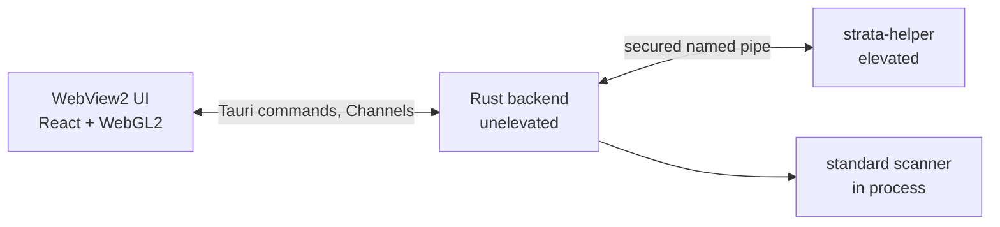
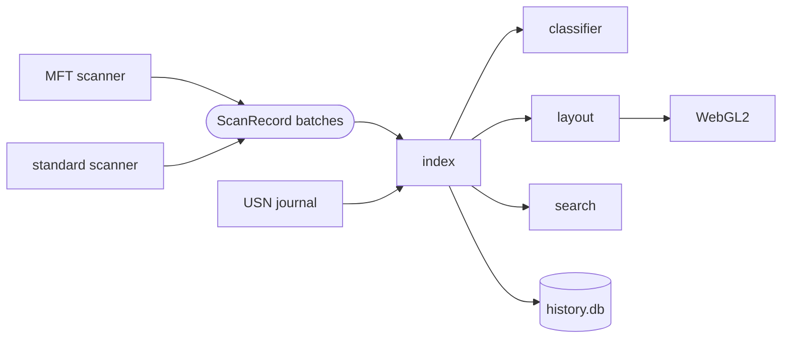

# Architecture

How Strata is built: the processes and their trust boundary, the path from disk to pixels, the
size-accounting rules, the deletion safety model and persistence. Each component's README is
listed under [Components](#components).

## Process model

| Process | Privilege | Responsibilities |
|---|---|---|
| App | Unelevated, always | Window, WebView2 UI, in-memory index, classification, layout, search, history, unprivileged cleanup |
| Helper, on demand | Elevated through UAC (`ShellExecuteExW`, verb `runas`) | Raw MFT scans, USN journal reads, MFT record re-reads, validated privileged deletes. Serves one app process; exits when the app disconnects or exits, or after 30 idle minutes |
| Helper, service mode | `StrataHelper` service, `LocalSystem`, manual start | Same requests without a UAC prompt per launch. Interactive users may start it; it serves only the configured app image run by a local administrator, and stops after 5 idle minutes |

The UI never runs elevated: an elevated WebView2 widens the attack surface of a web runtime and
breaks drag-and-drop from Explorer. At startup the helper removes every privilege except
`SeBackupPrivilege`, `SeManageVolumePrivilege` and `SeChangeNotifyPrivilege`, and enables the
first two only while a volume is being opened. Deletes run with ordinary administrator access
checks, so a file that denies administrators stays undeletable.

The helper treats the app as untrusted input. The pipe establishes *who* is talking; the helper
still validates *what* is asked. Deletes are accepted only as volume, file id, expected path,
expected size and expected modification time, and are re-checked against the helper's own copy
of the never-delete list ([Deletion safety](#deletion-safety)). Every privileged action produces
audit records that the app stores.

Activity tracking (`strata-etw`) needs administrator rights because Windows restricts kernel
trace sessions to administrators. It runs one real-time ETW session, `Strata-FileActivity`,
with the Kernel-File and Kernel-Process providers, and samples events when its consumer exceeds
the CPU cap (2% by default).

## Helper pipe

| Layer | Mechanism |
|---|---|
| Name | On demand: `\\.\pipe\strata-helper-<user SID>-<128-bit random hex>` from `BCryptGenRandom`, passed on the helper's command line. Service: `\\.\pipe\strata-helper-svc-<user SID>` per signed-in user |
| Creation | `FILE_FLAG_FIRST_PIPE_INSTANCE` (a squatted name fails), `PIPE_REJECT_REMOTE_CLIENTS`, one instance per pipe |
| DACL (SDDL) | `D:P(A;;0x120183;;;<user>)(A;;GA;;;SY)(A;;RC;;;OW)S:(ML;;NW;;;ME)`: the user gets read/write only (no create-instance, no `WRITE_DAC`); SYSTEM full; owner rights limited to `READ_CONTROL`. The SID is validated before it is formatted into the string |
| Integrity label | Explicit medium label, no-write-up, so the medium-integrity app can connect to an elevated creator while low-integrity and AppContainer processes cannot |
| Peer verification | Before any byte is parsed: client PID from the kernel, then image path, start time and Authenticode signer. The image must be the expected binary, and its signer's subject and issuer must equal the helper's own. The app verifies the helper the same way and connects with `SECURITY_IDENTIFICATION`, so an impostor server cannot impersonate it |
| Handshake | `Hello { protocol, build, client_pid }` → `Welcome { protocol, helper_build, elevated, capabilities }` or `Reject`. The protocol version (2) must match exactly; `client_pid` must equal the kernel-reported PID |
| Rate limit | Token bucket per connection: bursts of 200, 100 requests/s sustained; excess requests get a `RateLimited` error |

Signers are matched by subject and issuer, not leaf thumbprint, because signing services rotate
leaf certificates. Revocation checks are off so the handshake never waits on the network.

Every message is one frame. Payloads are [postcard](https://docs.rs/postcard) encodings.

| Offset | Size | Field | Encoding |
|---|---|---|---|
| 0 | 4 | `len` | u32 LE, bytes after this field (`5 + payload`), at most 64 MiB |
| 4 | 1 | `kind` | 1 Hello, 2 Welcome, 3 Reject, 4 Request, 5 Response |
| 5 | 4 | `request_id` | u32 LE; 0 for the handshake |
| 9 | `len − 5` | payload | postcard; must decode to exactly `len − 5` bytes |

`len` is checked before the body is read, so an oversized frame is never allocated. A framing
error closes the connection. Postcard identifies enum variants by position, so every change to a
message type bumps the protocol version.

Requests: `Ping`, `ListVolumes`, `ScanVolume` (streams `ScanProgress` and `ScanBatch`, then
`ScanDone`), `Cancel`, `QueryUsnJournal`, `CreateUsnJournal`, `ReadUsn`, `ReadRecords`,
`PrivilegedDelete`, `DeleteOnReboot`, `Shutdown`. Any request may receive a typed `Error`.

## Data flow

Both scanners emit the same `ScanRecord`: file reference, one name link per hardlink name,
attributes, flags, four timestamps, sizes, reparse data and alternate data streams. The index
never knows which scanner ran; scanner-specific gaps are flags (`ALLOC_ESTIMATED`,
`ACCESS_DENIED`, `PARTIAL`).

| Stage | Design |
|---|---|
| MFT scanner | Opens `\\.\X:` unbuffered with sector-aligned buffers and reads the `$MFT` runlist from record 0, so a fragmented MFT is read fragment by fragment in 8 MiB chunks. An I/O thread feeds a bounded channel; a rayon pool applies update-sequence fixups, parses attributes and merges extension records. Torn and corrupt records are counted and skipped. The parser never panics on malformed input and is fuzzed |
| Standard scanner | Work-stealing parallel walk (2 × logical CPUs, 4–64 threads) listing with `FileIdExtdDirectoryInfo`. An attribute-only pass per file fills hardlink counts, alternate streams and WOF allocation. All paths are `\\?\` form; opens use `NtCreateFile` with `FILE_OPEN_REPARSE_POINT` and `FILE_OPEN_NO_RECALL` |
| Index | Struct-of-arrays columns addressed by `u32` entry ids, contiguous child lists, names in one WTF-8 buffer, sizes as `u32` with a spill map for larger values. Lookup by file reference is a binary search over a sorted column. Under 64 bytes per entry, names excluded |
| Aggregates | Per folder, in both size modes: subtree logical and allocated bytes, file and folder counts, newest and oldest modification time, largest descendant. Built bottom-up in parallel; a live change updates the parent chain in O(depth) and returns a `ChangeSet` |
| Live updates | The USN journal is tailed with blocking reads, coalesced per tick, refreshed by re-reading changed MFT records, and applied as deltas. An idle volume costs no CPU. A wrapped or recreated journal triggers a rescan. Journals with 128-bit file ids (ReFS) are not tailed |
| Index cache | `STRATIDX` file per volume: a 128-byte header (format version, volume serial, USN journal id, last applied USN, counts, xxh3 checksum) and a section table with an xxh3 per section. A valid cache is loaded and caught up from the journal; any mismatch falls back to a scan |
| Search | One parallel pass over the name buffer with column filters checked first; results stream per chunk, and each keystroke cancels the previous query |

Numbers for each stage are in [BENCHMARKS.md](BENCHMARKS.md).

## Size accounting

Every entry carries both sizes; the size mode (Allocated by default, or Logical) switches every
view without recomputation.

| Quantity | Definition |
|---|---|
| Logical | Size of the unnamed `$DATA` stream: what Explorer's "Size" shows |
| Allocated | Clusters used by the unnamed stream. Resident data = 0. Compressed or sparse: the attribute's total-allocated value. WOF: the allocation of the `WofCompressedData` stream |
| Alternate streams | Logical and allocated bytes of named streams, counted toward the file (`WofCompressedData` excluded, as it is already the allocation) |
| Folder overhead | `$INDEX_ALLOCATION` bytes, counted toward the folder itself |
| Entry total | Allocated + streams + overhead (logical mode: logical + stream logical) |

| Case | Rule |
|---|---|
| Hardlinks | One file record, counted once at its first name. Other paths show "Hardlink (counted elsewhere)" and contribute 0 |
| WOF / CompactOS, sparse, compressed | Allocated from the actual clusters, so a 100 GB sparse file with 1 MB written counts 1 MB |
| Cloud placeholders | Counted at allocated size (usually near 0), with the logical size shown separately |
| Reparse points | Symlinks, junctions and mount points are never traversed; they are leaves pointing at their target |
| NTFS metadata | System records and `$Extend` children go under a virtual **NTFS metadata** node |
| Orphans and cycles | Records with a missing, reused or non-folder parent, and every member of a parent cycle, go under a virtual **Orphaned entries** node. Nothing is dropped |

Volume used space = entry totals + NTFS metadata + virtual blocks + unaccounted. When elevated,
shadow copy storage (`Win32_ShadowStorage`) becomes a **System Restore / Shadow copies** block.
The remainder is shown as **Unaccounted / system reserved** ([FAQ](FAQ.md#what-is-unaccounted--system-reserved)).

## Classification

Rules are TOML packs embedded in the binary and extendable from a user rules folder; schema,
precedence and authoring are in [RULES.md](RULES.md). Each entry gets a category, an owning app
and a safety tier:

| Tier | Meaning |
|---|---|
| `safe` | Regenerable, no user data |
| `probably` | Likely junk; review recommended |
| `careful` | User data or large re-downloads; extra confirmation |
| `never` | No delete action anywhere. User rules cannot relax a built-in `never` |

App attribution draws on the registry Uninstall keys (machine, 32-bit and per user), AppX
packages, rule labels and folder names. Each attribution carries a confidence (`exact`, `high`,
`heuristic`) and its evidence.

## Layout and rendering

Layouts run in Rust, in device pixels: squarified treemap, icicle, sunburst, circle packing and
mind map. Children too small to draw are folded into a hatched "N small items" block, and
off-screen subtrees are skipped. Output is deterministic and written as fixed 32-byte
little-endian records, sent over a Tauri Channel and uploaded directly as WebGL2 instance data.

| Offset | Type | Rectangles | Arcs | Circles |
|---|---|---|---|---|
| 0 | f32 | `x` | `a0` | `cx` |
| 4 | f32 | `y` | `a1` | `cy` |
| 8 | f32 | `w` | `r0` | `r` |
| 12 | f32 | `h` | `r1` | `aux` |
| 16 | u32 | `id` | same | same |
| 20 | u32 | `color_key` | same | same |
| 24 | u32 | `parent` record index (`0xFFFFFFFF` for none) | same | same |
| 28 | u16 | `depth` | same | same |
| 30 | u16 | `flags` (`DIR`, `HAS_HEADER`, `AGGREGATE`, `SELECTABLE`, `TRUNCATED`, `CLIPPED`) | same | same |

Every color mode is packed into `color_key`, so switching color modes is a shader change, not a
relayout. Hit testing runs in the UI on the same buffer, so hover never round-trips to the
backend.

## Deletion safety

Deletion is the only destructive operation, and every layer fails closed.

| Layer | Rule |
|---|---|
| Never-delete list | In code, independent of rule packs, enforced by the app backend and again by the helper: volume roots, `System Volume Information`, `$Recycle.Bin`, NTFS metadata, boot files and folders, paging/hibernation/swap files, the Windows folder (except specific temp and cache folders), Program Files roots and `WindowsApps`, the profiles root and every profile root, known-folder roots, top-level system+hidden items and Strata's install folder. A request is refused if it *is*, *contains* or, for subtree rules, *is inside* a protected location |
| Canonicalization | Every spelling is checked: `\\?\`, `\??\`, UNC, administrative shares, volume GUID and NT device roots (with every mount point), trailing dots and spaces, and 8.3 short names |
| Handle checks | The item is opened without following reparse points and its resolved path is checked again. Its volume serial and file id must match what the scan saw, as must size and modification time for files. Items with unverified identity are refused |
| Recycle Bin (default) | `IFileOperation` on a dedicated STA thread, with ancestors held open so none can be swapped for a junction. A progress sink aborts any item the Shell would delete permanently. Afterwards the item must resolve inside `$Recycle.Bin`. Restore moves the payload back and never overwrites |
| Pre-flight | Reports items that cannot be recycled (no Recycle Bin, too large, path too long) and asks before deleting them permanently |
| Locks | Restart Manager names the processes holding a file; closing one is a polite close after consent, never a kill |
| Audit log | Write-ahead: a row is committed before each item is touched and completed after. Rows left open by a crash are marked interrupted on the next launch |

## Persistence

| Store | Location | Contents | Durability |
|---|---|---|---|
| `history.db` (SQLite, WAL) | `%LOCALAPPDATA%\app.strata.desktop\store\` | Folder-size snapshots (~12 bytes per folder), activity rollups, duplicate hash cache. All rebuildable | `synchronous=NORMAL` |
| `state.db` (SQLite, WAL) | `%LOCALAPPDATA%\app.strata.desktop\store\` | Settings, undo/audit log | `synchronous=FULL` |

The databases are separate so that resetting a damaged history never loses settings or the undo
log that Recycle Bin restores depend on, and so a long snapshot commit never delays a
write-ahead delete record. Health is checked on open; a damaged database is reported and can be
reset without affecting the other. Retention runs daily. See [PRIVACY.md](PRIVACY.md).

## Components

| Component | README |
|---|---|
| Desktop app (Tauri backend) | [src-tauri](../src-tauri/README.md) |
| Frontend | [ui](../ui/README.md) |
| Shared types | [strata-core](../crates/strata-core/README.md) |
| MFT scanner | [strata-ntfs](../crates/strata-ntfs/README.md) |
| Command-line scanner | [strata-cli](../crates/strata-cli/README.md) |
| Standard scanner | [strata-walk](../crates/strata-walk/README.md) |
| Index, aggregates, search, cache | [strata-index](../crates/strata-index/README.md) |
| Layout engines | [strata-layout](../crates/strata-layout/README.md) |
| Classifier and app attribution | [strata-classify](../crates/strata-classify/README.md) |
| Built-in rule packs | [rules](../rules/README.md) |
| Deletion safety | [strata-clean](../crates/strata-clean/README.md) |
| Persistence | [strata-store](../crates/strata-store/README.md) |
| Win32 layer | [strata-win](../crates/strata-win/README.md) |
| Helper pipe | [strata-ipc](../crates/strata-ipc/README.md) |
| Elevated helper and service mode | [strata-helper](../crates/strata-helper/README.md) |
| Live updates | [strata-live](../crates/strata-live/README.md) |
| Duplicates | [strata-dupes](../crates/strata-dupes/README.md) |
| Activity tracking (ETW) | [strata-etw](../crates/strata-etw/README.md) |
| Website | [site](../site/README.md) |
